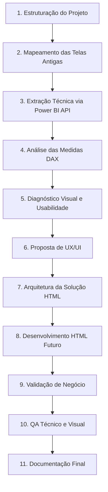

# Fases do Projeto

O projeto de Refatoração de Telas de BI para HTML segue um cronograma estruturado em 11 fases lógicas para garantir a qualidade de entrega, acurácia analítica e robustez técnica.

---

---

## Detalhamento das Fases

### Fase 1: Estruturação do Projeto
- **Objetivo**: Criar o repositório, definir a estrutura de pastas e consolidar os arquivos Markdown iniciais.
- **Entregáveis**: Repositório configurado, README principal e arquivos base estruturados.

### Fase 2: Mapeamento das Telas Antigas
- **Objetivo**: Investigar visualmente e funcionalmente as telas de EBITDA, Rentabilidade e Custos diretamente nos relatórios vigentes do Power BI.
- **Entregáveis**: Mapeamento geral preliminar de páginas, indicadores, visuais e filtros.

### Fase 3: Extração Técnica via Power BI API
- **Objetivo**: Utilizar endpoints da API REST do Power BI para coletar metadados estruturais do relatório de forma automatizada e fidedigna.
- **Entregáveis**: JSONs de metadados contendo a descrição de tabelas, colunas, páginas e visuais extraídos.

### Fase 4: Análise das Medidas DAX
- **Objetivo**: Isolar, catalogar e documentar a lógica de todas as medidas DAX que calculam os indicadores das telas no escopo.
- **Entregáveis**: Dicionário de medidas DAX contendo fórmulas, dependências estruturais e status de validação técnica.

### Fase 5: Diagnóstico Visual e de Usabilidade
- **Objetivo**: Mapear as falhas de usabilidade, lentidão, excesso de informação (noise), falta de contraste ou problemas de navegação no painel original.
- **Entregáveis**: Relatório de pontos de melhoria e diagnóstico crítico de UX/UI.

### Fase 6: Proposta de UX/UI
- **Objetivo**: Projetar a nova experiência visual utilizando melhores práticas de design moderno, como layouts focados em tomadores de decisão (design executivo).
- **Entregáveis**: Especificações de layout, paleta de cores, tipografia e fluxo de navegação do novo dashboard.

### Fase 7: Arquitetura da Solução HTML
- **Objetivo**: Modelar como os componentes web finais se comportarão, a estrutura de pastas do código frontend, bibliotecas de gráficos (ex: Chart.js, Highcharts) e como os dados serão consumidos da API.
- **Entregáveis**: Documentação de arquitetura da nova solução, padrões de componentes HTML e interatividades mapeadas.

### Fase 8: Desenvolvimento HTML Futuro
- **Objetivo**: Codificar a estrutura frontend baseada nos padrões definidos na arquitetura.
- **Entregáveis**: Código-fonte da aplicação HTML, CSS (Vanilla) e JavaScript.

### Fase 9: Validação de Negócio
- **Objetivo**: Realizar testes paralelos para garantir que a lógica das métricas aplicadas no HTML corresponde exatamente ao modelo de dados do Power BI.
- **Entregáveis**: Ata de homologação de regras de negócio e validação dos cálculos matemáticos.

### Fase 10: QA Técnico e Visual
- **Objetivo**: Testar responsividade da página em múltiplos navegadores e dispositivos, checar erros no console do navegador e bugs visuais.
- **Entregáveis**: Relatório de bugs de QA resolvidos.

### Fase 11: Documentação Final
- **Objetivo**: Consolidar todos os aprendizados, decisões do projeto e manuais de manutenção técnica da nova aplicação.
- **Entregáveis**: Documentação final atualizada e entrega do projeto.
